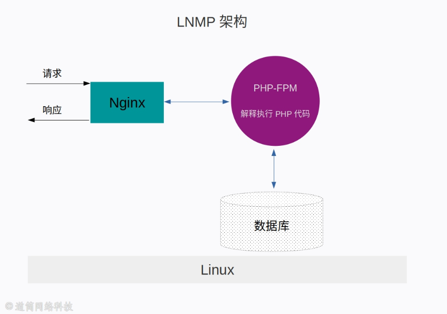

# 关于CMS与开发实践课总结
## 第一章 什么是CMS
### 一、CMS全称内容管理系统(Content Management System)

可以非常简单，甚至只有一个静态页面，可以时不时进行更新页面的内容，复杂则可以包罗万象，可以和很多人一起使用该系统。

### 二、有哪些类型的CMS

 1.博客 

 2.企业官网 

 3.商城 

 4.新闻资讯 

### 三、简单的CMS框架图

## 第二章 运行环境和开发环境
### 一、为何服务环境推荐使用Linux/Unix

其中重要原因是开源，因为开源所以企业可以免费使用获取源码，并且可以自己拓展开发。也由于开源，所以其内核的接口都可以调用，可以明确知道用哪些接口实现高性能的软件。

基于这些平台的工具有很多优秀的产品，例如Nginx利用Linux和Unix提供的内核级的异步IO接口实现高性能服务。

除此之外，还有一个重要因素就是稳定性，使用Linux/Unix平台，资源占有率比Windows要低的多,效率却可以长时间运行。

### 二、编程语言和框架示例图

 LNMP框架示例图 

 Nginx和Node.js框架 

## 第三章 搭建环境
### 一、搭建Node.js环境

本课程测试和实验的代码都是在Windows系统下进行的，所以这里搭建环境选择了在Windows平台部署。在Node官网中下载Windows版本并进行默认安装

### 二、测试环境

 编写以下代码并用Node执行 

 const os = require('os'); 

 console.log(`Node 运行在 ${os.platform()}`); 

### 三、测试结果

## 第四章 实现最小框架
### 一、实现最小框架的结构示意图

### 二、创建空目录之后，切换到新创建的此目录然后运行以下命令（运行之后空目录中会出现node_modules文件夹和package-lock.json文件）

 npm init -y 

 npm i titbit 

 npm i titbit-loader 

### 三、在创建好的目录中创建ceshi1.js文件并在其中加入响应代码，并在此目录下运行以下命令，之后访问http://localhost:8008/

 (1)运行命令 

 node ceshi1.js 

 (2)运行结果如下 

 (3)访问http://localhost:8008/结果示意图 

 (4)mdata文件示意图

## 第五章 添加显示图片功能
## 第六章 重构设计并使用数据库
## 第七章 重新设计目录结构并开始开发
## 第八章 使用TextLight
